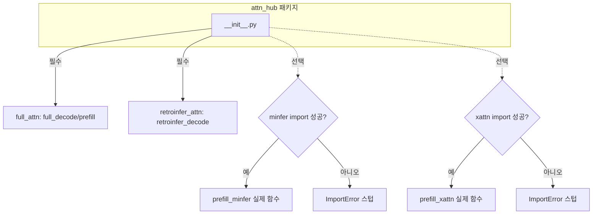

# `attn_hub/__init__.py` 분석

## 개요
`attn_hub` 패키지의 **공개 API 관문(facade)** 입니다. 어텐션 연산 함수들을 한곳에서 export 하며, 선택적(optional) prefill 방법은 **지연 import + 실패 시 대체 스텁**으로 처리해 미설치 의존성 때문에 패키지 전체가 깨지지 않도록 합니다.

## export 대상
| 심볼 | 출처 | 필수 여부 |
|---|---|---|
| `full_decode_attn`, `full_prefill_attn` | `full_attn.py` | 필수 (flash-attn) |
| `retroinfer_decode_attn` | `retroinfer_attn.py` | 필수 |
| `prefill_minfer` | `minfer.py` | 선택 (MInference 미설치 시 스텁) |
| `prefill_xattn` | `xattn.py` | 선택 (Block-Sparse-Attention 미설치 시 스텁) |

## 핵심 패턴
`try/except ImportError`로 감싸, 의존성이 없으면 호출 시점에 명확한 `ImportError` 메시지를 던지는 **더미 함수**를 대신 바인딩합니다. 즉, `minfer`/`xattn`을 실제로 쓰지 않는 한 설치가 없어도 import 단계는 통과합니다.

## 블록 다이어그램

## 주의
소비자(`model_hub/llama.py`, `qwen.py`)는 이 관문을 통해 어텐션 함수를 가져옵니다. 스텁 덕분에 `--prefill_method full` 경로는 minfer/xattn 미설치와 무관하게 동작합니다.
