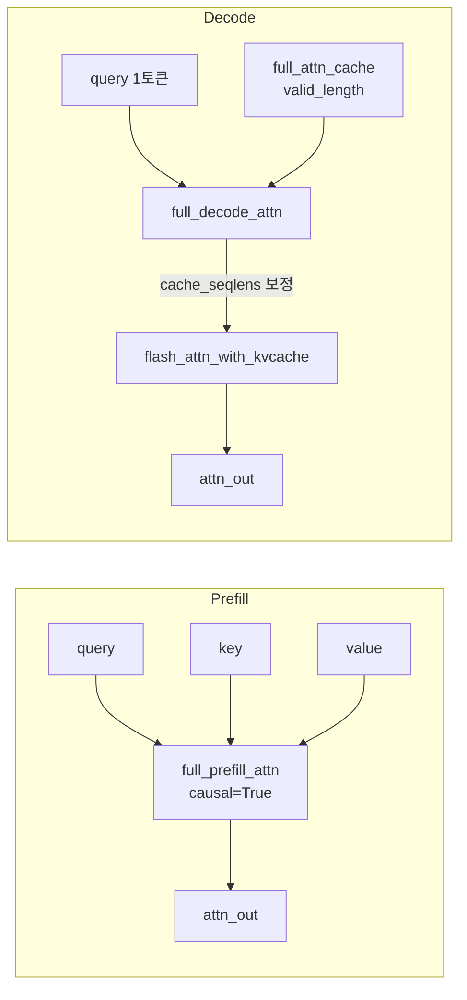

# `attn_hub/full_attn.py` 분석

## 개요
**Full(밀집) FlashAttention** 경로를 담당합니다. RetroInfer의 희소 어텐션과 비교되는 기준선(baseline)이자, `attn_type='Full_Flash_Attn'`일 때 실제로 사용되는 어텐션 함수입니다. FlashAttention 2의 `flash_attn_with_kvcache`를 얇게 감쌉니다.

## 함수
| 함수 | 단계 | 설명 |
|---|---|---|
| `full_prefill_attn(q, k, v, causal)` | Prefill | 입력 컨텍스트 전체에 대해 causal FlashAttention 수행 |
| `full_decode_attn(q, k, v, layer_idx, full_attn_cache)` | Decode | KV 캐시를 이용한 1스텝 디코딩 어텐션 |

## 핵심 로직
- **valid_len 처리**: `full_decode_attn`은 마지막 레이어(`layer_idx == layer_num-1`)인지에 따라 `cache_seqlens`를 `valid_length` 또는 `valid_length+1`로 설정합니다. 레이어별로 KV가 캐시에 기록되는 타이밍 차이를 보정하기 위한 오프셋입니다.
- 실제 연산은 전량 `flash_attn_with_kvcache`에 위임합니다(정확 어텐션, 근사 없음).

## 블록 다이어그램

## 의존성 · 주의
- `flash_attn`(FlashAttention 2.x)에 직접 의존 → **Ampere(sm_80+) GPU 필요**.
- 이 모듈이 `attn_hub/__init__.py`에서 최상단 import되므로, flash-attn 미설치 시 패키지 import 자체가 실패합니다.
