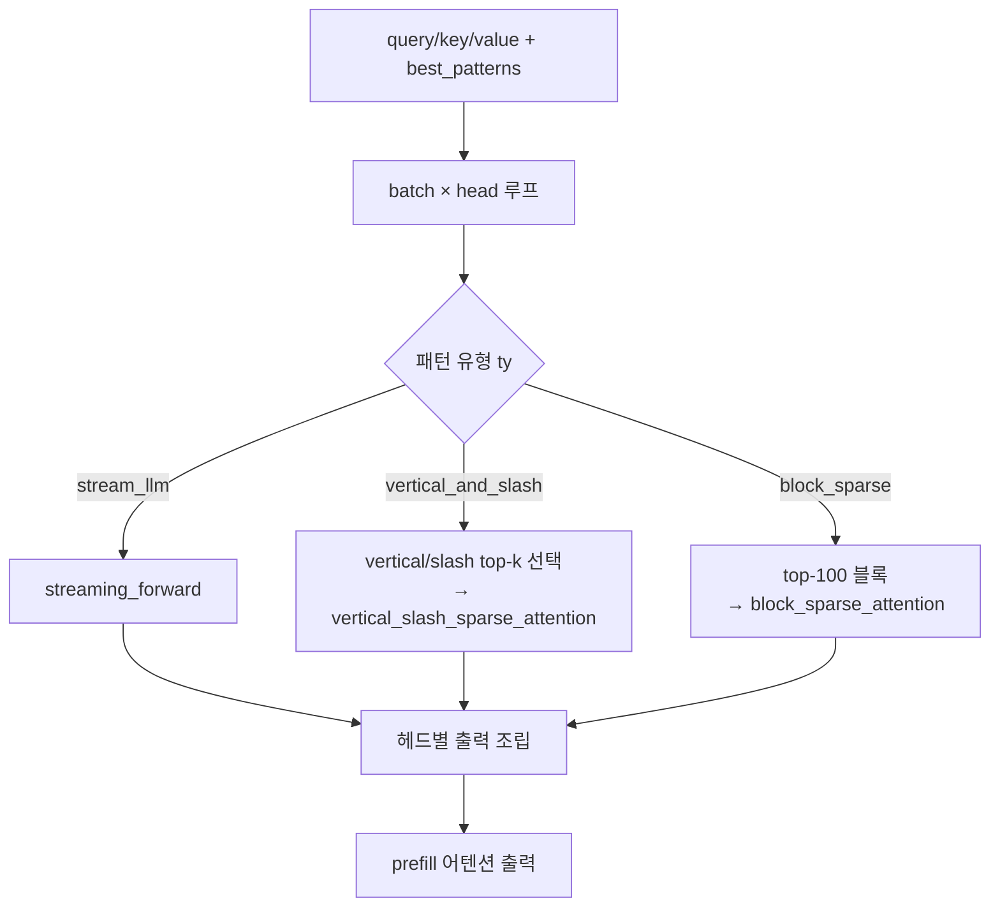

# `attn_hub/minfer.py` 분석

## 개요
[MInference](https://arxiv.org/pdf/2407.02490)의 **동적 희소 prefill** 방법을 이식한 모듈입니다(`--prefill_method minfer`). 각 어텐션 헤드마다 미리 정해진 희소 패턴(`stream_llm`, `vertical_and_slash`, `block_sparse`)을 선택해, 긴 컨텍스트 prefill의 계산량을 줄입니다.

## 주요 구성 요소
| 함수 | 역할 |
|---|---|
| `sum_all_diagonal_matrix(mat)` | as_strided 트릭으로 행렬의 모든 대각선 합을 계산(slash 패턴 점수화용) |
| `minference_prefill_kernel(q,k,v,best_pattern)` | 패턴 유형(`ty`)에 따라 적절한 커널로 분기 |
| `vertical_and_slash_kernel` | 최근 64개 query로 QK 점수 계산 → vertical/slash 위치 top-k 선택 → `vertical_slash_sparse_attention` |
| `block_sparse_kernel` | 상위 100개 블록으로 `block_sparse_attention` |
| `prefill_minfer(...)` | batch×head 루프를 돌며 헤드별 패턴을 적용, 출력 조립 |

## 핵심 로직
- 헤드별 최적 패턴은 외부에서 주입되는 `best_patterns[str(head)]`(모델별 프로파일, `model_hub/minfer_patterns.py`)로 결정됩니다.
- GQA(grouped-query attention)를 고려해 `group = head // kv_group_size`로 KV 헤드를 매핑합니다.

## 블록 다이어그램

## 의존성 · 주의
- `minference` 패키지 필요(`pip install minference==0.1.6.0`). 미설치 시 `attn_hub/__init__.py`가 스텁으로 대체.
- CUDA 전용(모듈 로드 시 `torch.arange(..., device="cuda:0")` 사용).
