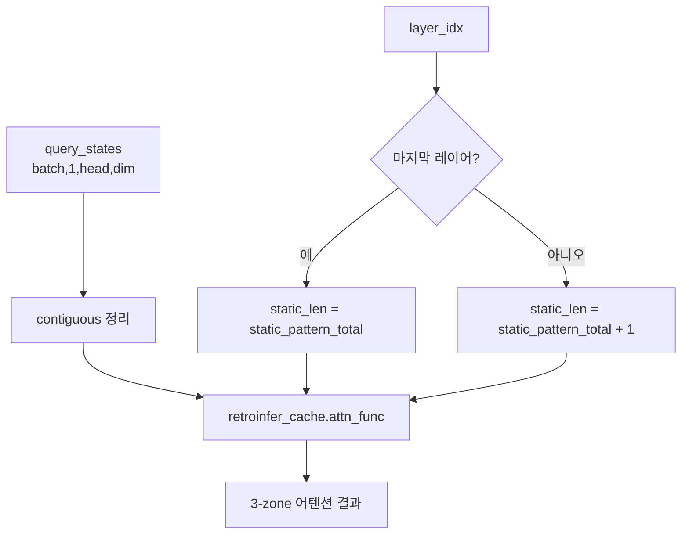

# `attn_hub/retroinfer_attn.py` 분석

## 개요
RetroInfer 디코딩 어텐션의 **얇은 디스패처(dispatcher)** 입니다. 실제 무거운 로직(steady/retrieval/estimation 3-zone 계산, wave index 검색, wave buffer 이동)은 `retroinfer_cache` 객체 내부에 있고, 이 함수는 query를 정리해 캐시의 `attn_func`로 넘깁니다.

## 함수
`retroinfer_decode_attn(query_states, key_states, value_states, layer_idx, retroinfer_cache)`
- 입력 `query_states` shape: `(batch_size, 1, head_num, dim)` (GPU 텐서, 디코딩 1스텝).
- `key_states`/`value_states`는 인터페이스 통일을 위해 받지만 실제 KV는 캐시 객체가 관리합니다.

## 핵심 로직
- **static_len 계산**: `layer_idx`가 마지막 레이어인지에 따라 `static_pattern_total` 또는 `+1`로 설정 → steady zone(고정 토큰)의 유효 길이 보정.
- `query_states.contiguous()`로 메모리 연속성을 보장한 뒤 `retroinfer_cache.attn_func(query, layer_idx, static_len)` 호출로 위임.

## 블록 다이어그램

## 주의
- 이 파일 자체에는 연산이 거의 없습니다. RetroInfer의 실제 어텐션 알고리즘은 `cache_hub/retroinfer_cache.py`(CPU 오프로드) / `retroinfer_cache_gpu.py`(GPU 전용)의 `attn_func`에 구현됩니다.
