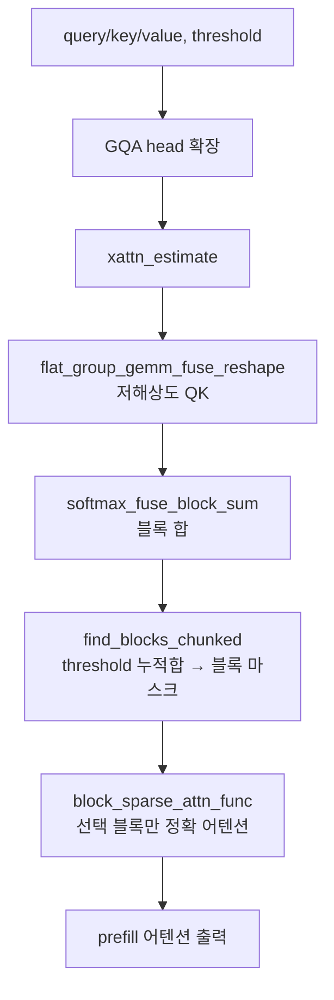

# `attn_hub/xattn.py` 분석

## 개요
[XAttention](https://arxiv.org/pdf/2503.16428)의 **블록 희소 prefill** 방법을 이식한 모듈입니다(`--prefill_method xattn`). 대각선(antidiagonal) 패턴 기반으로 어텐션 블록의 중요도를 추정하고, 임계값(threshold)을 넘는 블록만 골라 `block_sparse_attn_func`로 실제 어텐션을 계산합니다. 추정 단계는 Triton 커널로 가속됩니다.

## 주요 구성 요소
| 구성 | 역할 |
|---|---|
| `softmax_fuse_block_sum_kernel_causal/non_causal` (Triton) | 어텐션 가중치에 대한 online-softmax + 블록 단위 합을 융합 계산 |
| `flat_group_gemm_fuse_reshape_kernel` (Triton) | stride로 재구성한 Q·K의 group GEMM을 융합 수행 |
| `find_blocks_chunked(...)` | 누적합이 `threshold`에 도달할 때까지 블록을 선택하는 boolean 마스크 생성 |
| `xattn_estimate(...)` | 청크 단위로 블록 중요도 추정 → `(attn_sums, simple_masks)` 반환 |
| `Xattention_prefill(...)` | 추정 마스크로 `block_sparse_attn_func` 호출해 실제 어텐션 계산 |
| `prefill_xattn(...)` | GQA 확장 처리 후 `Xattention_prefill` 진입점(stride=8) |

## 핵심 로직
1. **추정(estimate)**: Q/K를 `stride`로 다운샘플·재구성해 저해상도 어텐션 점수를 구하고, 블록별 합으로 중요도를 산출.
2. **선택(select)**: `find_blocks_chunked`가 threshold 기반 누적합으로 블록 마스크를 만들고, causal/keep_sink/keep_recent 보정 적용.
3. **계산(compute)**: 선택된 블록에만 `block_sparse_attn_func`를 적용해 정확 어텐션 수행.

## 블록 다이어그램

## 의존성 · 주의
- `triton`, `block_sparse_attn`(Block-Sparse-Attention) 필요. 미설치 시 `attn_hub/__init__.py`가 스텁으로 대체.
- Triton 커널은 특정 GPU("100" 계열, 즉 A100/H100 등)에서만 활성화되며, 아니면 `use_triton=False`로 폴백.
