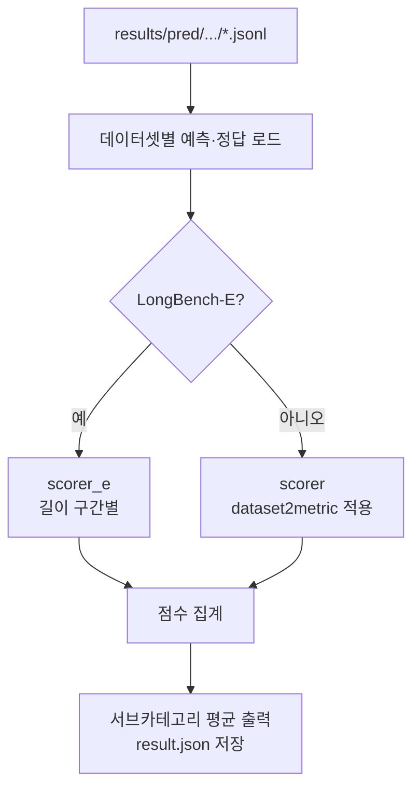

# `benchmark/longbench/eval.py` 분석

## 개요
`pred.py`가 생성한 예측 jsonl을 읽어 **LongBench 정확도를 채점**하는 스크립트입니다. 데이터셋마다 적절한 지표 함수를 적용하고, 6개 서브카테고리(단일/다중 문서 QA, 요약, few-shot, 합성, 코드) 평균을 출력합니다.

## 주요 구성 요소
| 구성 | 역할 |
|---|---|
| `dataset2metric` | 데이터셋→지표 함수 매핑(qa_f1/rouge/classification/retrieval/count/code_sim 등) |
| `sub_categories` | 데이터셋을 6개 상위 범주로 그룹화 |
| `scorer(...)` | 표준 채점(예측당 정답 후보 중 최대 점수 평균×100) |
| `scorer_e(...)` | LongBench-E용 길이 구간별(0-4k/4-8k/8k+) 채점 |

## 블록 다이어그램

## 의존성 · 주의
- `metrics.py`의 지표 함수에 의존. GPU 불필요(CPU 채점).
- 입력 경로는 `pred.py`의 출력 규약(`results/pred[_e]/{model}/{attn_type}/`)과 일치해야 함.
