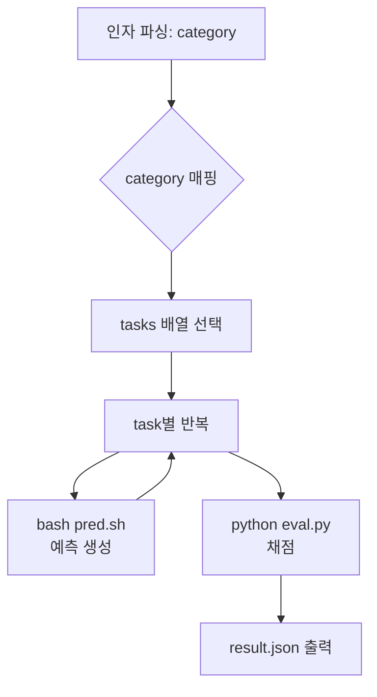

# `benchmark/longbench/longbench_run.sh` 분석

## 개요
LongBench 벤치마크를 **범주(category) 단위로 실행하고 채점하는 최상위 스크립트**입니다. 지정한 상위 범주에 속하는 데이터셋 목록을 순회하며 `pred.sh`로 예측을 생성한 뒤, `eval.py`로 정확도를 채점하고 결과를 출력합니다.

## 인자 (6개)
`<model> <attn_type> <budget_ratio> <estimate_ratio> <dtype> <category>`
- `category`: `SQA`/`MQA`/`SUM`/`FSL`/`ST`/`CC` → 각각 대응하는 데이터셋 배열로 매핑.

## 핵심 로직
1. `category`에 따라 `tasks` 배열 선택(예: `SQA` → qasper, multifieldqa_en, narrativeqa).
2. 각 task마다 `bash pred.sh ...` 실행(예측 생성).
3. 전체 예측 완료 후 `python eval.py`로 채점.
4. `results/pred/<model>/<attn_type>/result.json` 출력.

## 블록 다이어그램

## 의존성 · 주의
- `pred.sh`, `eval.py`에 의존. 예측 단계는 CUDA GPU 필요.
- README의 `longbench_run.sh llama-3-8b-1048k RetroInfer 0.018 0.232 bf16 SQA` 예시에 해당.
