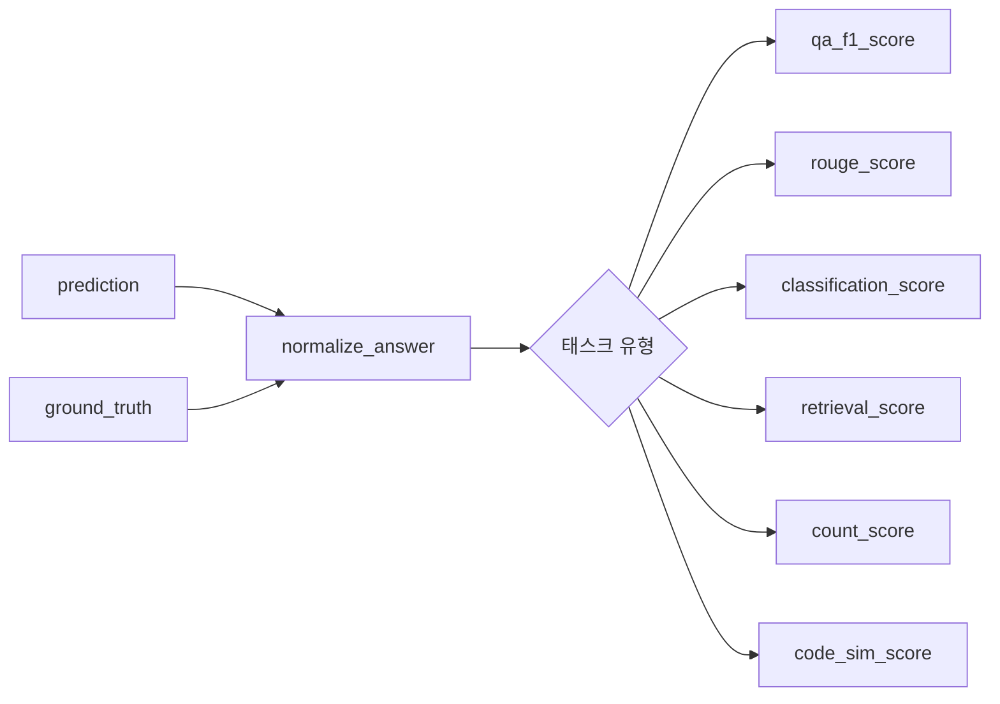

# `benchmark/longbench/metrics.py` 분석

## 개요
LongBench 채점에 사용되는 **지표(metric) 함수 모음**입니다. 영어/중국어 QA, 요약(ROUGE), 분류, 검색, 카운트, 코드 유사도 등 태스크 유형별 점수 함수를 제공합니다. `eval.py`의 `dataset2metric`이 이 함수들을 참조합니다.

## 주요 함수
| 함수 | 유형 | 설명 |
|---|---|---|
| `normalize_answer` / `normalize_zh_answer` | 전처리 | 소문자화·구두점/관사 제거·공백 정규화(영/중) |
| `qa_f1_score` / `qa_f1_zh_score` | QA | 토큰 단위 F1(중국어는 jieba 분절) |
| `rouge_score` / `rouge_zh_score` | 요약 | ROUGE-L F1(중국어는 jieba 분절) |
| `classification_score` | 분류 | 예측에 포함된 클래스명 기반 점수 |
| `retrieval_score` / `retrieval_zh_score` | 검색 | 정답 문단 번호와 예측 숫자 일치율 |
| `count_score` | 카운트 | 예측 숫자와 정답 카운트 일치율 |
| `code_sim_score` | 코드 | fuzzywuzzy 문자열 유사도 |

## 블록 다이어그램

## 의존성 · 주의
- `jieba`(중국어 분절), `fuzzywuzzy`, `rouge`에 의존. GPU 불필요.
- 순수 채점 유틸리티로, RetroInfer 추론 로직과는 무관합니다.
