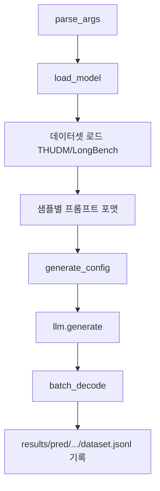

# `benchmark/longbench/pred.py` 분석

## 개요
[LongBench](https://github.com/THUDM/LongBench) 벤치마크에서 **모델 예측(prediction)을 생성**하는 스크립트입니다. 각 데이터셋을 HuggingFace에서 로드해, 지정한 어텐션 방식(`Full_Flash_Attn`/`RetroInfer`)으로 응답을 생성하고 jsonl로 저장합니다.

## 주요 구성 요소
| 구성 | 역할 |
|---|---|
| `parse_args()` | `--model`, `--task`, `--e`(LongBench-E), `--num_examples` + 모델/설정 인자 |
| `load_model(...)` | 경로에 'Llama'/'Qwen' 포함 여부로 모델 생성, pad_token/좌측 패딩 설정 |
| `get_pred(...)` | 데이터별 프롬프트 포맷팅 → `generate_config` → `llm.generate` → 디코딩 → jsonl 기록 |
| `seed_everything(42)` | 결정적 실행(cudnn deterministic 포함) |

## 핵심 로직
- 설정 파일 4종(`model2path`, `model2maxlen`, `dataset2prompt`, `dataset2maxlen`)으로 태스크별 프롬프트/최대 생성 길이 결정.
- 입력 길이에 맞춰 매 샘플마다 `generate_config` 호출(RetroInfer 클러스터 수 등 재계산).
- `do_sample=False`, `ignore_eos=True`로 결정적 생성.

## 블록 다이어그램

## 주의
- 출력은 `results/pred/{model}/{attn_type}/{dataset}.jsonl`. 이후 `eval.py`가 채점.
- CUDA GPU 필요.
