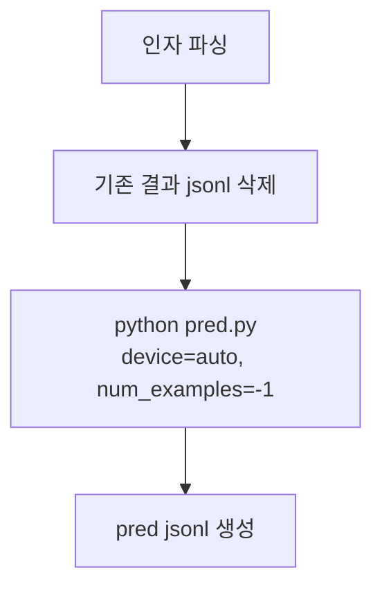

# `benchmark/longbench/pred.sh` 분석

## 개요
LongBench **단일 태스크의 예측을 생성하는 래퍼 스크립트**입니다. 이전 결과 파일을 지우고 `pred.py`를 적절한 인자로 실행합니다. `longbench_run.sh`가 태스크마다 이 스크립트를 호출합니다.

## 인자 (6개)
`<model_name> <task_name> <attn_type> <dtype> <budget_ratio> <estimate_ratio>`

## 핵심 로직
1. 기존 `results/pred[_e]/<model>/<attn_type>/<task>.jsonl` 삭제(재실행 대비).
2. `python pred.py`를 다음 옵션으로 실행: `--task`, `--attn_type`, `--model`, `--dtype`, `--device auto`, `--retrieval_budget`, `--estimation_budget`, `--num_examples -1`(전체).

## 블록 다이어그램

## 의존성 · 주의
- `pred.py`에 의존. CUDA GPU 필요(`--device auto`로 멀티 GPU 분산).
- `numactl` 바인딩 라인은 주석 처리되어 있습니다.
