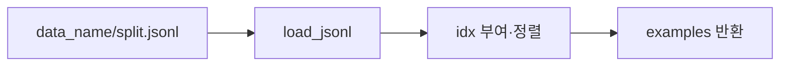

# `benchmark/reasoning/data_loader.py` 분석

## 개요
추론 벤치마크의 **데이터셋 로더**입니다. `{data_dir}/{data_name}/{split}.jsonl`을 읽어 인덱스(`idx`)를 붙이고 정렬해 반환합니다.

## 함수
`load_data(data_name, split, data_dir, args)`
- jsonl 로드(없으면 `NotImplementedError`).
- `math_500`은 `args.level`로 난이도 필터링.
- `idx`가 없으면 부여, `idx` 기준 정렬.

## 블록 다이어그램

## 주의
GPU 불필요. `utils.load_jsonl`에 의존. `math_eval.prepare_data`가 호출합니다.
