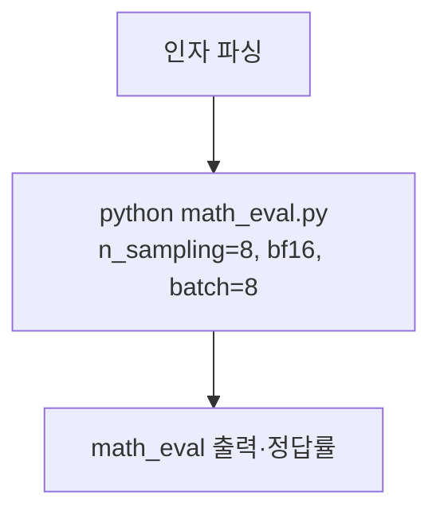

# `benchmark/reasoning/eval.sh` 분석

## 개요
긴 추론(reasoning) 벤치마크를 실행하는 **래퍼 스크립트**입니다. `math_eval.py`를 고정된 샘플링 설정으로 호출해 AIME/GPQA 등에서 정답률을 측정합니다.

## 인자 (5개)
`<model_name_or_path> <attn_type> <data_name> <start> <num_test_sample>`
- 출력 디렉터리는 `<model>/math_eval`.

## 핵심 로직
- `set -ex`로 명령 출력·오류 시 중단.
- `math_eval.py`를 다음 주요 설정으로 실행: `prompt_type=orz`, `max_tokens_per_call=32768`, `n_sampling=8`(pass@8), `temperature=0.6`/`top_p=0.95`/`top_k=20`, `do_sample`, `dtype=bf16`, `batch_size=8`, `--save_outputs --overwrite`.
- `TOKENIZERS_PARALLELISM=false`로 경고 억제.

## 블록 다이어그램

## 의존성 · 주의
- `math_eval.py`에 의존. CUDA GPU 필요.
- `numactl` 바인딩 라인은 주석 처리. README의 `eval.sh <model> RetroInfer aime24 0 -1` 예시에 해당.
