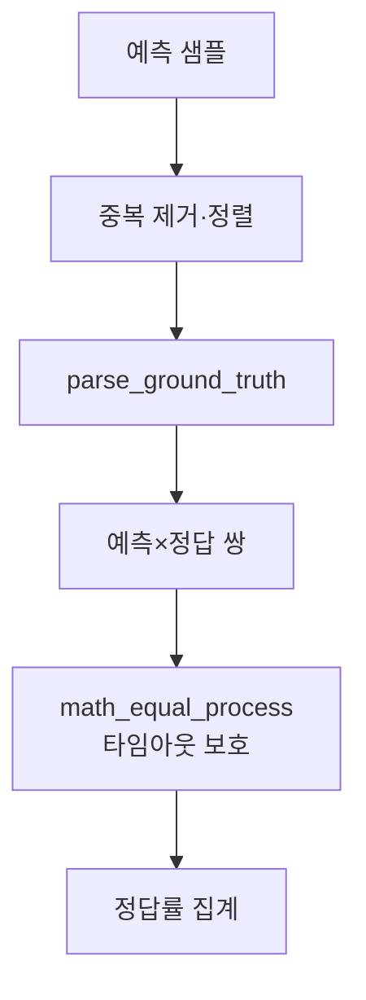

# `benchmark/reasoning/evaluate_utils.py` 분석

## 개요
추론 벤치마크의 **채점 오케스트레이터**입니다. 예측 샘플들을 정답과 대조해 정답률을 집계합니다. `grader.math_equal_process`를 타임아웃 보호와 함께 호출합니다.

## 함수
`evaluate(data_name, prompt_type, samples/file_path, ...)`
- 샘플 로드·중복 제거·정렬.
- `parser.parse_ground_truth`로 정답 추출.
- 각 (예측, 정답) 쌍을 `math_equal_process`로 채점(타임아웃 카운트 관리).
- 정답률/통계 반환.

## 블록 다이어그램

## 의존성 · 주의
- `grader.py`, `parser.py`, `utils.load_jsonl`에 의존. GPU 불필요.
- `math_eval.main`이 최종 채점에 이 함수를 사용합니다.
