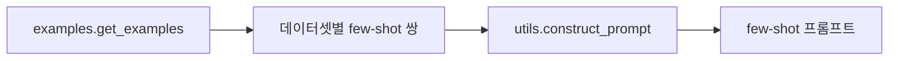

# `benchmark/reasoning/examples.py` 분석

## 개요
few-shot 프롬프트 구성에 쓰이는 **예시(demonstration) 데이터 모듈**입니다. 데이터셋별(gsm8k 등) (질문, 풀이) 쌍을 담은 상수 테이블을 제공합니다.

## 함수
`get_examples()` → `{dataset_name: [(question, solution), ...]}` 형태의 dict 반환.

## 블록 다이어그램

## 주의
순수 데이터 파일(로직 없음), GPU 불필요. `utils.construct_prompt`가 프롬프트 앞에 예시를 붙일 때 참조합니다.
