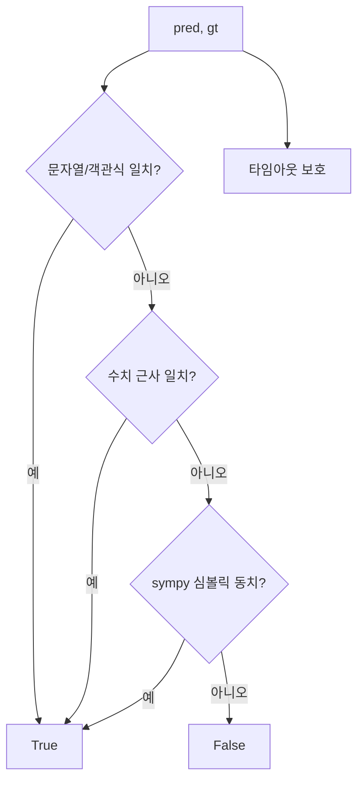

# `benchmark/reasoning/grader.py` 분석

## 개요
예측 답과 정답의 **수학적 동치성(math equivalence)을 판정하는 채점 엔진**입니다. Hendrycks MATH/PRM800K/ToRA/DeepSeek-Math의 채점 로직을 종합 이식했습니다. 문자열 일치를 넘어 수식·수치·집합·행렬 수준의 동치를 판정합니다.

## 주요 함수(대표)
| 함수 | 역할 |
|---|---|
| `math_equal(pred, gt, ...)` | 핵심 판정: 수치 근사, sympy 심볼릭 단순화, 집합/구간 비교 등 다단계 |
| `math_equal_process(param)` | 타임아웃 보호 래퍼(멀티프로세싱) |
| `choice_answer_clean` | 객관식 답 정리 |
| `parse_digits`/`numeric_equal` 등 | 수치 파싱·근사 비교 |

## 핵심 로직
1. 문자열/객관식 직접 비교.
2. 실패 시 `parse_digits`로 수치화해 `isclose` 근사 비교.
3. 그래도 실패 시 `sympy`로 심볼릭 단순화 후 동치 판정.
4. 무한 루프 방지를 위해 타임아웃 적용.

## 블록 다이어그램

## 의존성 · 주의
- `sympy`, `latex2sympy2`, `regex`에 의존. GPU 불필요, CPU 집약적(멀티프로세싱).
- `evaluate_utils.py`, `rm_maj_eval.py`가 이 판정을 사용합니다.
