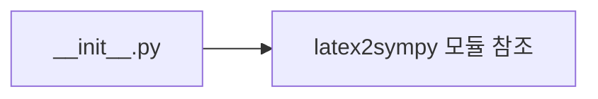

# `benchmark/reasoning/latex2sympy/__init__.py` 분석

## 개요
latex2sympy 패키지 초기화 파일입니다. 내용은 `import latex2sympy` 한 줄로, 패키지 로드 시 모듈 참조를 확보하는 최소 진입점입니다.

## 블록 다이어그램

## 주의
서드파티 라이브러리의 패키지 관문. 실제 변환 로직은 `latex2sympy2.py`에 있습니다.
