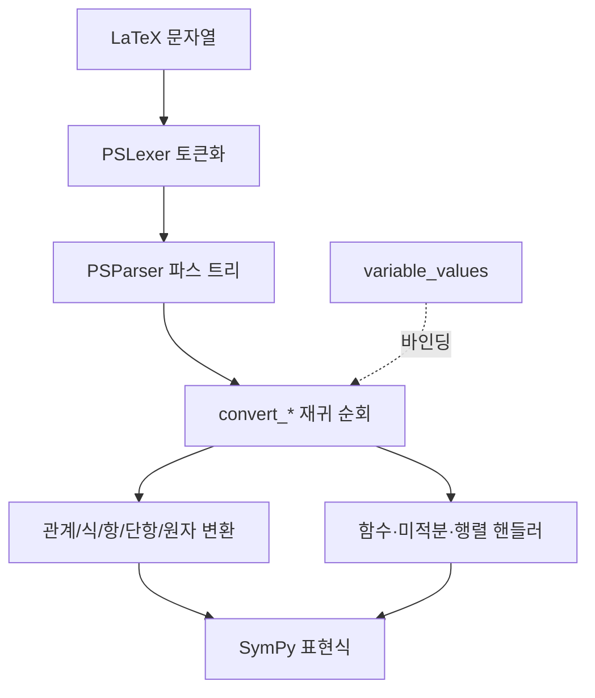

# `benchmark/reasoning/latex2sympy/latex2sympy2.py` 분석

## 개요
latex2sympy2 라이브러리의 **핵심 변환기**입니다. ANTLR로 생성된 파서(`gen/`)가 만든 LaTeX 파스 트리를 순회하며, 각 문법 노드를 대응하는 **SymPy 표현식**으로 변환합니다. 산술·분수·거듭제곱·함수(삼각/로그/exp/gcd/lcm/floor/ceil)·미적분(적분/합/곱/극한/미분)·행렬/선형대수까지 처리합니다.

## 주요 함수(대표)
| 함수 | 역할 |
|---|---|
| `latex2sympy(sympy, variable_values)` | 진입점: LaTeX 문자열 → SymPy. 렉서·파서 실행 후 트리 변환 |
| `set_real` / `set_variances` | 실수 가정, 변수 값 바인딩 설정 |
| `convert_relation/expr/add/mp/unary/postfix/exp/comp/atom` | 표현식 계층별 변환(관계→덧셈→곱셈→단항→후위→지수→원자) |
| `convert_frac/binom/func/matrix` | 분수·이항계수·함수·행렬 변환 |
| `handle_integral/sum_or_prod/limit/exp/gcd_lcm/floor/ceil` | 미적분·특수 함수 처리 |
| `convert_elementary_transform` | 행렬 기본 변형(`\xrightarrow`) 처리 |
| `MathErrorListener` | 파싱 문법 오류 리포트 |
| `latex2latex(tex)` | LaTeX → (계산) → LaTeX |

## 변환 파이프라인

## 의존성 · 주의
- `sympy`, `antlr4-python3-runtime`, 그리고 생성 파서 `gen/PSLexer`·`PSParser`·`PSListener`에 의존. GPU 무관(순수 CPU).
- RetroInfer 본체와 무관한 **서드파티 라이브러리**로, `benchmark/reasoning`의 수학 답 채점(`parser.py`, `grader.py`)에서 LaTeX 정답 파싱에 사용됩니다.
