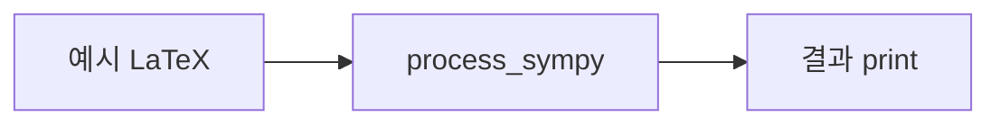

# `benchmark/reasoning/latex2sympy/sandbox/sandbox.py` 분석

## 개요
latex2sympy 개발자용 **실험/데모 스크립트(scratchpad)** 입니다. `process_sympy`(=latex2sympy)로 다양한 LaTeX 입력을 변환해 결과를 눈으로 확인하기 위한 즉석 코드로, 라이브러리 동작을 손으로 검증할 때 씁니다.

## 특징
- 대부분 주석 처리된 예시 + `print` 출력으로 구성.
- 변수 바인딩(`\variable{a}`) 같은 기능을 수동 실험.

## 블록 다이어그램

## 주의
정식 테스트가 아닌 개발용 스크래치입니다(자동 채점 대상 아님). 실제 검증은 `tests/`의 pytest가 담당합니다.
