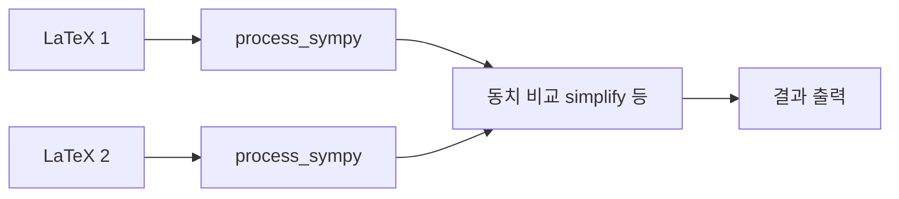

# `benchmark/reasoning/latex2sympy/sandbox/sandbox_equality.py` 분석

## 개요
SymPy 표현식의 **동치성(equality) 판정을 실험하는 개발용 스크립트**입니다. `process_sympy`로 변환한 두 식이 수학적으로 같은지 여러 방식(단순화 등)으로 확인해 봅니다.

## 블록 다이어그램

## 주의
개발용 스크래치(자동 테스트 아님). 실제 동치 판정 로직은 벤치마크의 `grader.py`가 담당합니다.
