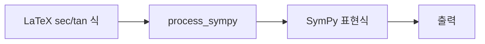

# `benchmark/reasoning/latex2sympy/sandbox/sectan.py` 분석

## 개요
**삼각함수(sec/tan 등)가 포함된 복잡 수식 파싱을 실험하는 개발용 스크립트**입니다. 플레이스홀더(`[!a!]` 등)와 삼각함수가 섞인 LaTeX를 변환해 결과를 확인합니다.

## 블록 다이어그램

## 주의
개발용 스크래치(자동 테스트 아님). 삼각함수 정식 검증은 `tests/trig_test.py`.
