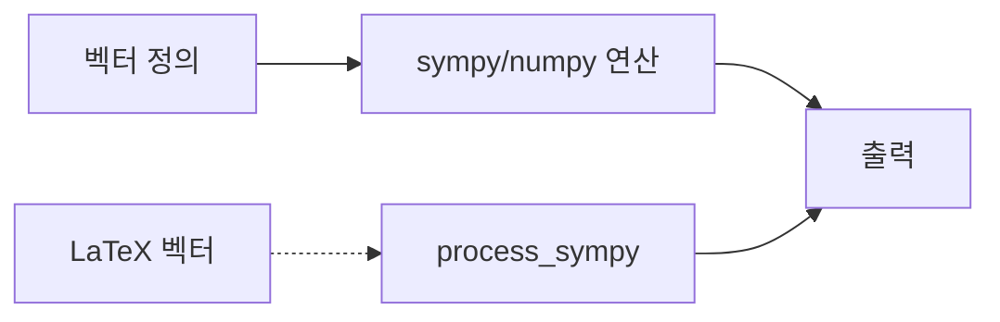

# `benchmark/reasoning/latex2sympy/sandbox/vector.py` 분석

## 개요
**벡터(행/열 행렬) 연산을 실험하는 개발용 스크립트**입니다. numpy/sympy로 벡터를 다루며 latex2sympy 변환 결과와 대조해 봅니다.

## 블록 다이어그램

## 주의
개발용 스크래치. `numpy`, `sympy`에 의존, GPU 무관.
