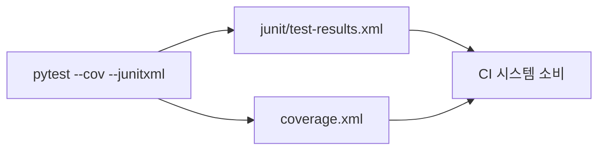

# `benchmark/reasoning/latex2sympy/scripts/coverage-ci.sh` 분석

## 개요
latex2sympy의 **CI 환경용 커버리지 실행 스크립트**입니다. venv 설정 없이 곧바로 pytest를 실행하며, CI가 소비할 수 있는 JUnit XML·커버리지 XML 리포트를 생성합니다.

## 핵심 로직
`pytest --doctest-modules --junitxml=junit/test-results.xml --cov-report=xml --cov-config=.coveragerc --cov=latex2sympy tests`

## 블록 다이어그램

## 의존성 · 주의
- `pytest`, `pytest-cov` 필요. GPU 무관.
- 로컬용 `coverage.sh`(HTML)와 달리 machine-readable XML 산출에 집중.
