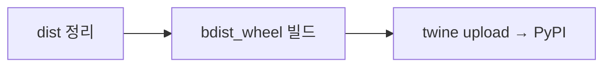

# `benchmark/reasoning/latex2sympy/scripts/publish.sh` 분석

## 개요
latex2sympy2 패키지를 **빌드하여 PyPI에 배포하는 스크립트**입니다(라이브러리 유지관리자용).

## 핵심 로직
1. `rm ./dist/*` — 이전 빌드 산출물 제거.
2. `python3 setup.py bdist_wheel` — wheel 빌드.
3. `twine upload dist/*` — PyPI 업로드.

## 블록 다이어그램

## 의존성 · 주의
- `setuptools`, `wheel`, `twine` 및 PyPI 자격증명 필요. GPU 무관.
- 서드파티 라이브러리 배포용으로, RetroInfer 사용자에게는 일반적으로 불필요합니다.
