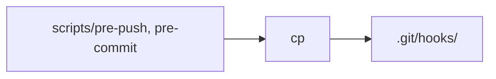

# `benchmark/reasoning/latex2sympy/scripts/setup-hooks.sh` 분석

## 개요
latex2sympy 개발용 **git 훅을 설치하는 스크립트**입니다. 저장소의 `pre-push`·`pre-commit` 훅 스크립트를 `.git/hooks/`로 복사합니다.

## 핵심 로직
```
cp scripts/pre-push   .git/hooks/
cp scripts/pre-commit .git/hooks/
```

## 블록 다이어그램


## 의존성 · 주의
- `git` 저장소 필요. GPU 무관.
- 커밋/푸시 전 자동 검사(예: 테스트·린트)를 활성화하는 개발 편의 스크립트입니다.
