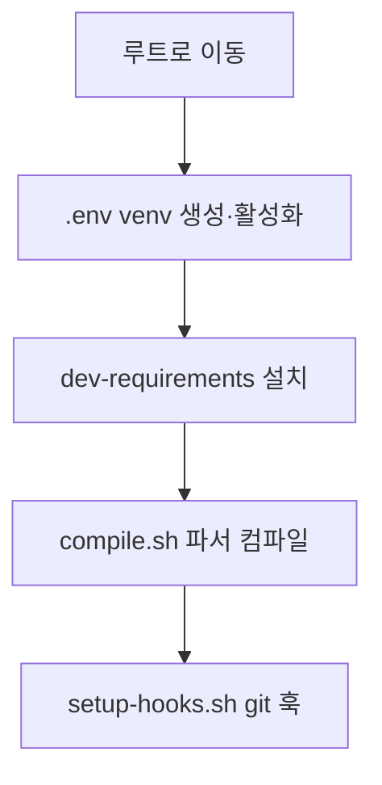

# `benchmark/reasoning/latex2sympy/scripts/setup.sh` 분석

## 개요
latex2sympy 라이브러리의 **개발 환경 초기화 스크립트**입니다. 프로젝트 루트로 이동해 가상환경 생성·활성화, 의존성 설치, ANTLR 파서 컴파일, git 훅 설정까지 한 번에 수행합니다.

## 핵심 로직
1. `git rev-parse --git-dir`로 프로젝트 루트 경로 계산 후 이동.
2. `.env` venv 생성(없으면) 및 활성화(`bin/activate` 또는 `Scripts/activate`).
3. `pip install -r dev-requirements.txt`.
4. `sh scripts/compile.sh`로 파서 컴파일.
5. `sh scripts/setup-hooks.sh`로 git 훅 설치.

## 블록 다이어그램

## 의존성 · 주의
- `python3`, `pip`, `java`(compile 단계), `git` 필요. GPU 무관(서드파티 라이브러리 개발용).
- 실패 지점마다 `exit 1`로 중단.
