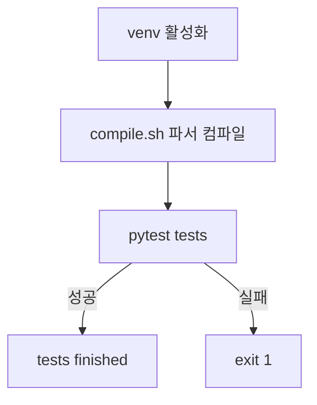

# `benchmark/reasoning/latex2sympy/scripts/test.sh` 분석

## 개요
latex2sympy의 **단위 테스트 실행 스크립트**입니다. venv 활성화 → 파서 재컴파일 → `pytest tests` 순으로 실행합니다.

## 핵심 로직
1. 프로젝트 루트 이동 후 `.env` venv 활성화.
2. `sh scripts/compile.sh`로 파서 최신화.
3. `pytest tests` 실행(실패 시 `exit 1`).

## 블록 다이어그램

## 의존성 · 주의
- `pytest`, Java(compile), venv 필요. GPU 무관.
- `tests/`의 pytest 스위트(abs/trig/linalg 등)를 실행합니다.
