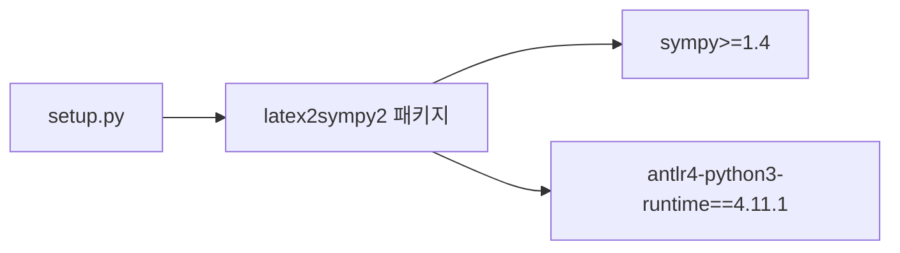

# `benchmark/reasoning/latex2sympy/setup.py` 분석

## 개요
latex2sympy2 라이브러리의 **패키지 설치 정의(setuptools)** 입니다. `pip install -e .`로 설치되며(README의 reasoning 벤치 준비 단계), 의존성으로 `sympy`와 특정 버전의 ANTLR 런타임을 요구합니다.

## 핵심 설정
| 항목 | 값 |
|---|---|
| name / version | latex2sympy2 / 1.9.0 |
| py_modules | `asciimath_printer`, `latex2sympy2` |
| install_requires | `sympy>=1.4`, `antlr4-python3-runtime==4.11.1` |
| license | MIT |

## 블록 다이어그램

## 주의
- ANTLR 런타임 버전(4.11.1)이 생성 파서(`gen/`)와 일치해야 합니다.
- GPU 무관.
