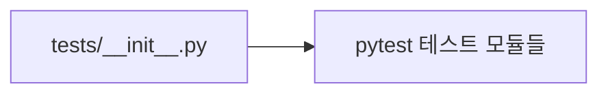

# `benchmark/reasoning/latex2sympy/tests/__init__.py` 분석

## 개요
latex2sympy `tests` 패키지의 초기화 파일입니다(빈 파일, 패키지 마커).

## 블록 다이어그램

```mermaid
flowchart LR
    I[tests/__init__.py] --> T[pytest 테스트 모듈들]
```

## 주의
테스트 디렉터리를 패키지로 인식시키기 위한 표식입니다.
