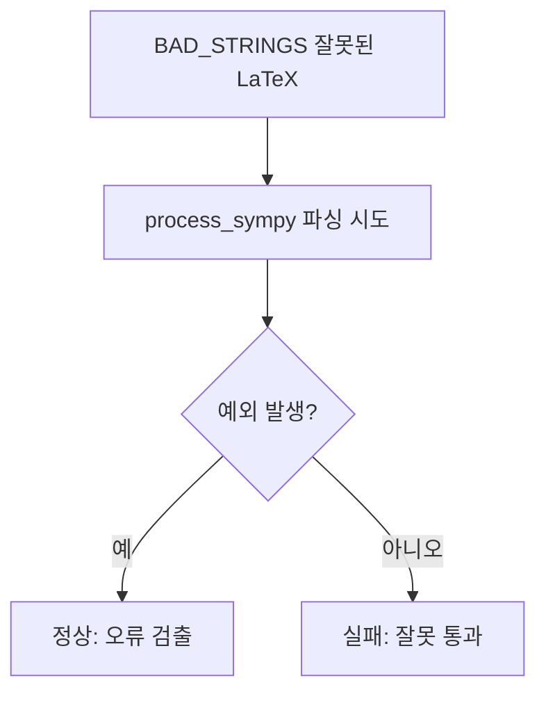

# `benchmark/reasoning/latex2sympy/tests/all_bad_test.py` 분석

## 개요
latex2sympy2가 **파싱에 실패(예외 발생)해야 하는 잘못된 LaTeX 입력을 검증하는 음성(negative) 테스트**입니다. 불완전한 괄호, 빈 분수, 인자 없는 `\int`/`\sqrt` 등 문법적으로 유효하지 않은 문자열이 조용히 통과하지 않고 예외를 던지는지 확인합니다.

## 구조
- `pytest_generate_tests`로 `TestAllBad.BAD_STRINGS` 목록을 파라미터화.
- 각 잘못된 문자열을 `process_sympy`로 파싱했을 때 **예외가 발생해야** 통과.

## 대표 BAD_STRINGS 예
`"("`, `")"`, `"\\frac{d}{dx}"`, `"\\sqrt{}"`, `"\\sqrt"`, `"{"`, `"}"`, `"\\frac{2}{}"`, `"\\int"` 등.

## 블록 다이어그램

## 의존성 · 주의
- `pytest`, `tests/context.py`에 의존. GPU 무관.
- 파서의 견고성(오류 입력 거부)을 지키는 것이 목적입니다(정상 케이스는 `all_good_test.py`).
