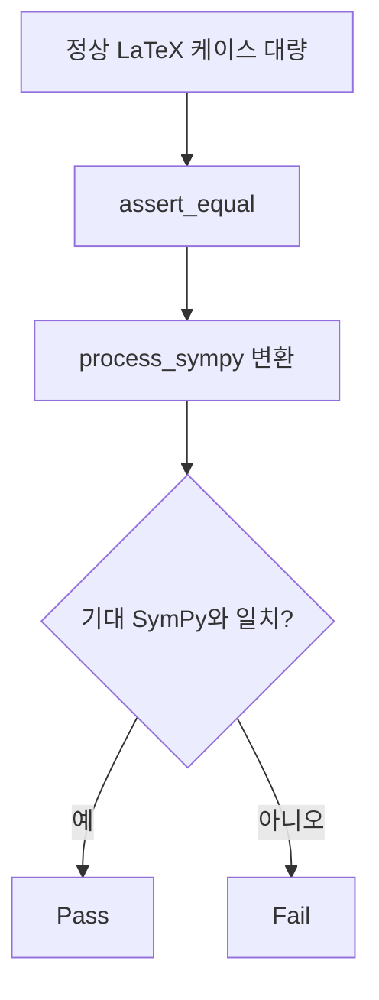

# `benchmark/reasoning/latex2sympy/tests/all_good_test.py` 분석

## 개요
latex2sympy2가 **정상적으로 파싱해야 하는 광범위한 LaTeX 입력을 한꺼번에 검증하는 종합 회귀 테스트**입니다. 산술·거듭제곱·삼각/쌍곡/역삼각함수·로그·적분/합/곱/극한/미분·행렬·부등식·mod/gcd/lcm/floor/ceil/max/min 등 라이브러리가 지원하는 거의 모든 기능을 다룹니다.

## 구조
- `from .context import assert_equal, process_sympy, _Add, _Mul, _Pow` 사용.
- SymPy의 다양한 심볼·함수를 import하고, `(입력 LaTeX, 기대 SymPy)` 케이스를 대량 나열.
- `assert_equal`로 각 케이스의 파싱 결과가 기대 표현식과 (구조/심볼릭) 일치하는지 확인.

## 블록 다이어그램

## 의존성 · 주의
- `pytest`, `sympy`, `tests/context.py`에 의존. GPU 무관.
- 라이브러리 전반의 정상 동작을 지키는 광범위 회귀 스위트입니다(반대 케이스는 `all_bad_test.py`).
