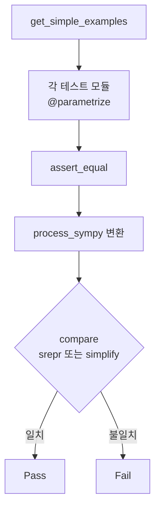

# `benchmark/reasoning/latex2sympy/tests/context.py` 분석

## 개요
latex2sympy 테스트들이 공유하는 **테스트 하네스(공통 유틸)** 입니다. LaTeX 입력을 변환한 결과가 기대 SymPy 표현식과 같은지 검증하는 헬퍼와, 여러 테스트에서 재사용하는 예시 셋을 제공합니다.

## 주요 함수
| 함수 | 역할 |
|---|---|
| `assert_equal(latex, expr, variable_values, symbolically)` | `process_sympy(latex)` 결과를 `compare`로 검증 |
| `compare(actual, expected, symbolically)` | `symbolically`면 `simplify(actual-expected)==0`, 아니면 `srepr` 트리 비교 |
| `get_simple_examples(func)` | 숫자/분수/√/π/변수 등 다양한 입력에 `func`를 적용한 (입력, 기대값, 심볼릭여부) 튜플 배열 생성 |
| `_Add/_Mul/_Pow` | `evaluate=False` 표현식 빌더(구조 비교용) |

## 핵심 로직
- **구조 비교(srepr)**: 단순 계산값이 아니라 표현식 트리 구조까지 일치하는지 확인(파싱 정확성 검증).
- **심볼릭 비교**: 변수 포함 식은 단순화 후 차이가 0인지로 판정.
- `get_simple_examples`는 여러 단항 함수 테스트(abs/floor/ceil 등)에서 입력 셋을 재사용하게 함.

## 블록 다이어그램

## 의존성 · 주의
- `sympy`, `latex2sympy2`, `pytest`에 의존. GPU 무관.
- 거의 모든 `*_test.py`가 `from .context import assert_equal, get_simple_examples`로 이 파일을 사용합니다.
