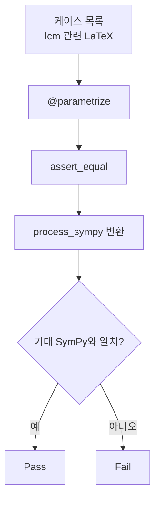

# `benchmark/reasoning/latex2sympy/tests/lcm_test.py` 분석

## 개요
latex2sympy2의 **최소공배수 lcm 변환을 검증하는 pytest 테스트**입니다. 여러 LaTeX 입력을 `process_sympy`로 변환해 기대 SymPy 표현식과 일치하는지 확인합니다.

## 구조
- `from .context import assert_equal[, get_simple_examples]`로 공통 하네스 사용.
- `@pytest.mark.parametrize`로 (입력, 기대값[, 심볼릭여부]) 케이스를 나열해 일괄 검증.
- 각 케이스는 `assert_equal(latex, expr)`로 파싱 결과를 대조(구조 비교 또는 심볼릭 단순화).

## 블록 다이어그램

## 의존성 · 주의
- `pytest`, `sympy`, `tests/context.py`에 의존. GPU 무관.
- 최소공배수 lcm 관련 문법 변환의 회귀(regression)를 막는 것이 목적입니다.
