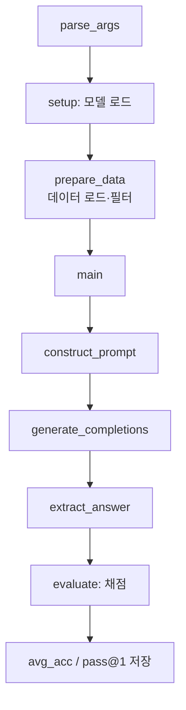

# `benchmark/reasoning/math_eval.py` 분석

## 개요
긴 추론(long reasoning) 벤치마크의 **메인 실행 스크립트**입니다(Qwen2.5-Math 계열 하네스 이식). AIME24/GPQA 같은 수학·과학 추론 데이터셋에서 RetroInfer/Full 어텐션으로 모델을 돌려 정답률(avg_acc, pass@k)을 측정합니다.

## 주요 함수
| 함수 | 역할 |
|---|---|
| `parse_args()` | `--data_names`, `--model_name_or_path`, 샘플링(temperature/top_p/top_k), `--n_sampling`, `--max_tokens_per_call` + 설정 인자 |
| `prepare_data(...)` | 데이터 로드, start/end·num_test_sample 슬라이싱, 출력 파일명 생성, 기존 처리분 제외 |
| `setup(args)` | 모델 로드 후 데이터셋별 `main` 실행, 전체 평균 산출 |
| `main(llm, tokenizer, data_name, args)` | 프롬프트 구성 → 생성 → 답 추출 → 채점 → 저장 |

## 핵심 로직
- `n_sampling`회 독립 샘플링으로 pass@k 계산.
- 프롬프트 유형(`prompt_type`, 기본 orz)에 따라 few-shot/템플릿 구성.
- 생성 결과에서 `parser.extract_answer`로 답 추출, `evaluate_utils.evaluate`로 정답 대조.

## 블록 다이어그램

## 의존성 · 주의
- `model_hub`, `config`, `evaluate_utils`, `parser`, `trajectory`, `data_loader`, `python_executor`, `model_utils`에 의존. CUDA GPU 필요.
- `--attn_type`(Full_Flash_Attn/RetroInfer), `--retrieval_budget`/`--estimation_budget`가 출력 파일명·설정에 반영됩니다.
