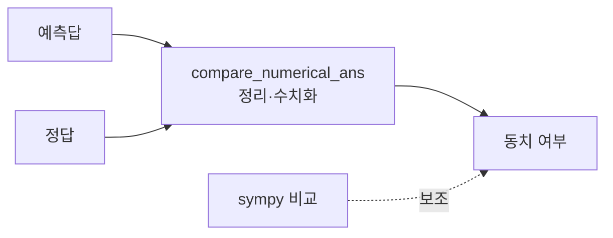

# `benchmark/reasoning/math_utils.py` 분석

## 개요
수학 답 비교를 돕는 **보조 유틸리티 모음**입니다. 수치·수식·부등식·집합 비교, LaTeX 파싱, 타임아웃 처리 등 `grader.py`를 보완하는 저수준 함수를 제공합니다.

## 주요 함수(대표)
| 함수 | 역할 |
|---|---|
| `compare_numerical_ans(ans_p, ans_l)` | 퍼센트·기호 정리 후 수치 근사 비교 |
| (sympy 기반) | 부등식·방정식 해 비교, 심볼릭 단순화 |
| (LaTeX 파싱) | `parse_latex`로 수식 해석 |

## 블록 다이어그램

## 의존성 · 주의
- `sympy`, `mpmath`, `timeout_decorator`, `pandas`에 의존. GPU 불필요.
- `grader.py`의 판정 로직을 뒷받침하는 헬퍼입니다.
