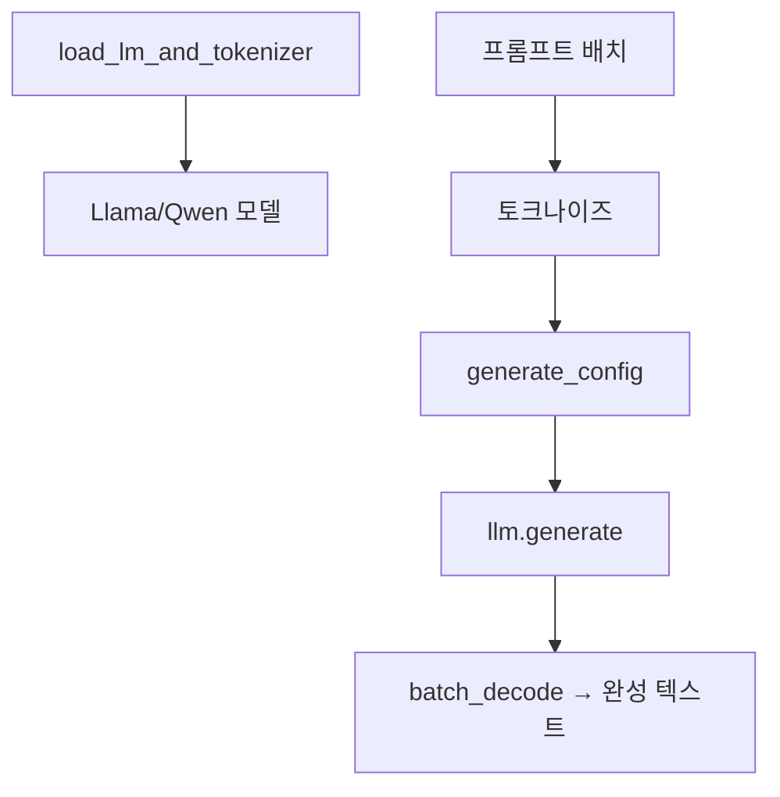

# `benchmark/reasoning/model_utils.py` 분석

## 개요
추론 벤치마크에서 **모델 로딩과 배치 텍스트 생성을 담당하는 유틸리티**입니다. RetroInfer의 `LlamaModel`/`QwenModel`을 로드하고, 프롬프트 배치를 받아 완성 텍스트를 생성합니다.

## 주요 함수
| 함수 | 역할 |
|---|---|
| `load_lm_and_tokenizer(...)` | 경로에 따라 Llama/Qwen 모델 + 토크나이저 로드 |
| `generate_completions(...)` | 프롬프트를 batch_size 단위로 토크나이즈 → `generate_config` → `llm.generate` → 디코딩, `num_return_sequences`(n_sampling) 지원 |

## 핵심 로직
- `@torch.no_grad()`로 추론.
- 각 배치마다 입력 길이에 맞춰 `generate_config` 호출(RetroInfer 파라미터 결정).
- 생성 결과에서 `parser.extract_answer`로 답 추출 가능.

## 블록 다이어그램

## 의존성 · 주의
- `model_hub`, `config`, `parser`에 의존. CUDA GPU 필요.
- `device="auto"`로 멀티 GPU 분산 로드.
