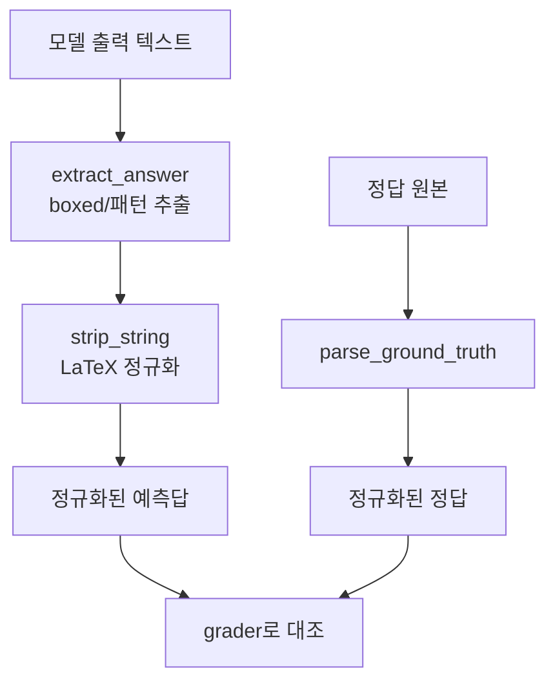

# `benchmark/reasoning/parser.py` 분석

## 개요
모델 출력과 정답에서 **수학적 답을 추출·정규화하는 파서 모듈**입니다. LaTeX 수식 정리, `\boxed{}` 추출, 단위·구두점 정리, 객관식(A~E) 정리 등을 수행해 채점 가능한 형태로 만듭니다.

## 주요 함수(대표)
| 함수 | 역할 |
|---|---|
| `_fix_fracs`/`strip_string` 등 | LaTeX 분수·표기 정규화 |
| `extract_answer(...)` | 생성 텍스트에서 최종 답(예: `\boxed{}`) 추출 |
| `parse_ground_truth(...)` | 데이터셋별 정답 추출 |
| `choice_answer_clean(...)` | 객관식 답 정리 |
| `construct_prompt`(utils 연계) | 프롬프트 조립 지원 |

## 블록 다이어그램

## 의존성 · 주의
- `latex2sympy2`, `sympy`, `regex`, `word2number`에 의존. GPU 불필요.
- 채점 정확도의 핵심으로, `grader.py`/`evaluate_utils.py`가 이 출력을 소비합니다.
