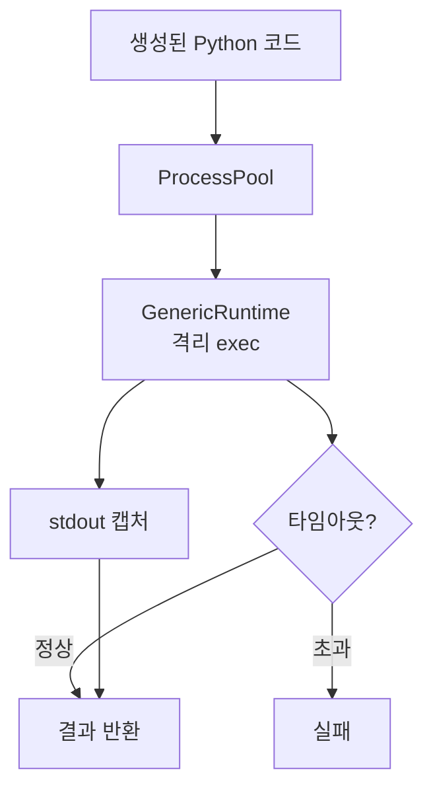

# `benchmark/reasoning/python_executor.py` 분석

## 개요
도구 통합 추론에서 모델이 생성한 **Python 코드를 안전하게 실행하고 표준출력/결과를 회수하는 실행기**입니다. 프로세스 풀 + 타임아웃으로 무한 루프·예외로부터 격리합니다.

## 주요 구성 요소
| 구성 | 역할 |
|---|---|
| `GenericRuntime` | 격리된 전역/지역 네임스페이스에서 코드 exec, 헤더 선행 실행 |
| `PythonExecutor` | 코드 배치를 프로세스 풀(`pebble`/`multiprocess`)로 병렬 실행, `redirect_stdout`으로 출력 캡처, `timeout`으로 시간 제한 |

## 핵심 로직
- 각 코드 스니펫을 별도 프로세스에서 실행해 메인 프로세스를 보호.
- 실행 결과(마지막 표현식 값 또는 stdout)와 예외를 문자열로 반환.
- 타임아웃 초과 시 실패 처리.

## 블록 다이어그램

## 의존성 · 주의
- `pebble`, `multiprocess`, `timeout_decorator`에 의존. GPU 불필요.
- `trajectory.py`의 program 세그먼트를 실행해 output을 채우는 데 사용됩니다. 신뢰할 수 없는 생성 코드를 실행하므로 격리가 중요합니다.
