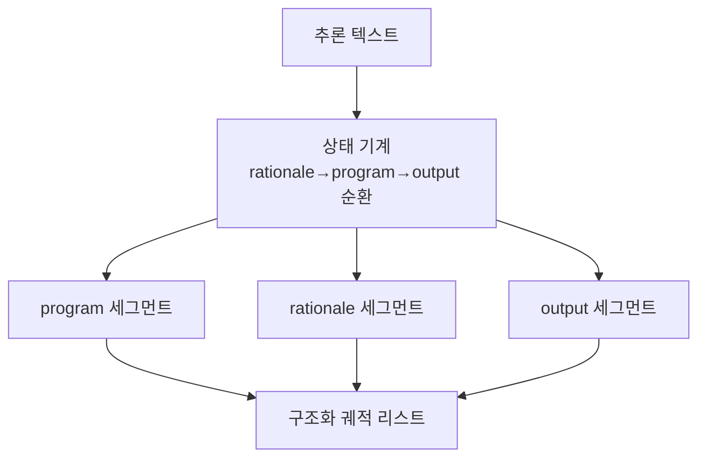

# `benchmark/reasoning/trajectory.py` 분석

## 개요
도구 사용형(tool-integrated) 추론 출력을 **rationale(추론)·program(코드)·output(실행결과)의 구조화된 궤적(trajectory)으로 파싱/복원하는 모듈**입니다. 코드 실행이 섞인 추론 텍스트를 역할별 세그먼트로 분해합니다.

## 궤적 형식
```
[
  {"role": "rationale", "content": "..."},
  {"role": "program",   "content": "```python ...```"},
  {"role": "output",    "content": "```output ...```"},
  ...
]
```

## 주요 함수
| 함수 | 역할 |
|---|---|
| `text_to_trajectory(traj_str)` | ```` ```python ````/```` ```output ```` 마커로 상태 기계를 돌려 역할별 세그먼트 리스트 생성 |
| (역변환 함수) | 궤적 → 텍스트 복원 |

## 블록 다이어그램


## 주의
GPU 불필요. `python_executor`가 program 세그먼트를 실행하고 output을 채우는 파이프라인에서 사용됩니다.
