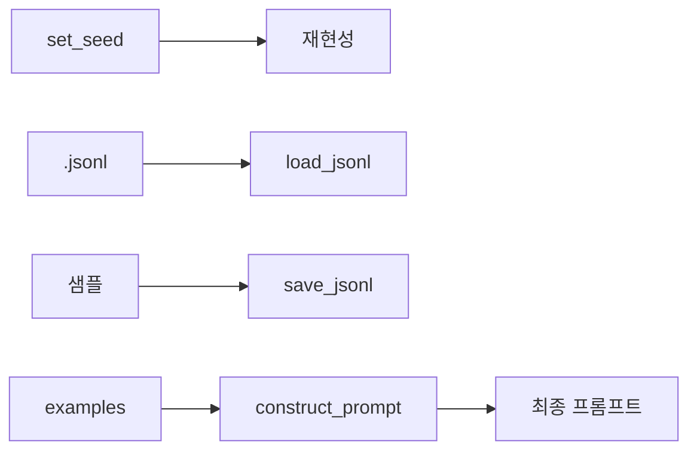

# `benchmark/reasoning/utils.py` 분석

## 개요
추론 벤치마크 전반에서 쓰는 **공통 유틸리티**입니다. 시드 고정, jsonl 입출력, 프롬프트 구성 등을 제공합니다.

## 주요 함수
| 함수 | 역할 |
|---|---|
| `set_seed(seed)` | numpy/random/torch(+CUDA) 시드 및 `PYTHONHASHSEED` 고정 |
| `load_jsonl(file)` | jsonl 제너레이터 로드(파싱 실패 시 종료) |
| `save_jsonl(samples, path)` | 폴더 생성 후 jsonl 저장 |
| `construct_prompt(...)` | few-shot 예시(`examples.get_examples`)로 프롬프트 조립 |

## 블록 다이어그램

## 의존성 · 주의
- `examples.py`에 의존. GPU 불필요.
- `math_eval.py` 등 대부분의 reasoning 스크립트가 이 헬퍼를 공유합니다.
