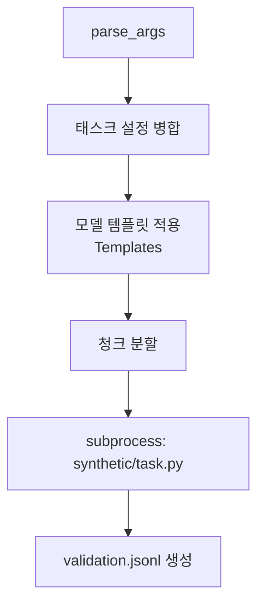

# `benchmark/ruler/data/prepare.py` 분석

## 개요
RULER 벤치마크 **데이터셋 생성을 조율(orchestrate)하는 스크립트**입니다(NVIDIA 원본 이식). 태스크 설정을 읽어 모델 채팅 템플릿을 적용하고, 실제 합성 데이터 생성기(`synthetic/<task>.py`)를 서브프로세스로 호출합니다.

## 주요 구성 요소
| 구성 | 역할 |
|---|---|
| `Templates` | 모델별 채팅 래핑 템플릿(base/meta-chat/vicuna/command-r/chatglm 등) |
| `main(args)` | `constants.TASKS` + `<benchmark>.yaml`로 태스크 설정 병합, 템플릿 조립, 청크 분할 후 생성기 실행 |

## 핵심 로직
- 태스크 템플릿 + `answer_prefix`를 모델 채팅 템플릿으로 감싸 최종 프롬프트 템플릿 생성.
- `--num_samples`를 `--chunk_amount`로 분할, 각 청크에 `random_seed = 42 + chunk_idx` 부여.
- `subprocess.run`으로 `synthetic/<task>.py`를 호출(토크나이저·최대 길이·생성 토큰 등 인자 전달).

## 블록 다이어그램

## 의존성 · 주의
- `nltk`(punkt), `yaml`에 의존. GPU 불필요(데이터 생성).
- 실제 샘플 생성은 `niah.py`/`variable_tracking.py`/`common_words_extraction.py`/`freq_words_extraction.py`/`qa.py`가 담당.
