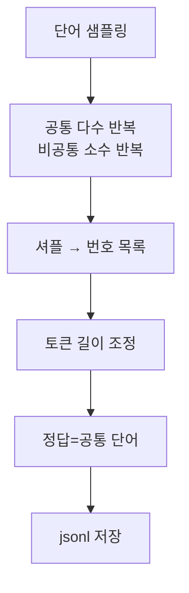

# `benchmark/ruler/data/synthetic/common_words_extraction.py` 분석

## 개요
RULER의 **자주 등장하는 단어 추출(common words extraction, `cwe`) 데이터셋 생성기**입니다. 번호가 매겨진 단어 목록에서 일부 단어를 다른 단어보다 훨씬 자주 반복시키고, 가장 자주 등장한 상위 10개 단어를 찾도록 합니다.

## 주요 함수
| 함수 | 역할 |
|---|---|
| `get_example(num_words, common_repeats, uncommon_repeats, common_nums)` | 공통(자주)·비공통(드문) 단어를 반복 배치해 "1. word 2. word ..." 목록 생성, 정답=공통 단어 |
| `generate_input_output(num_words)` | few-shot 예시 + 본 컨텍스트 조립 |
| `main()`/생성 루프 | 목표 길이에 맞게 단어 수 조정하며 샘플 생성·저장 |

## 핵심 로직
- 공통 단어는 `common_repeats`회(예: 30), 비공통은 `uncommon_repeats`회(예: 3) 반복 → 빈도 대비.
- 목록을 셔플해 위치 편향 제거, 정답은 상위 `num_cw`개 공통 단어.

## 블록 다이어그램

## 의존성 · 주의
- `wonderwords`, `tokenizer.py`에 의존. GPU 불필요.
- 채점은 `string_match_all`(정답 단어 포함 비율).
