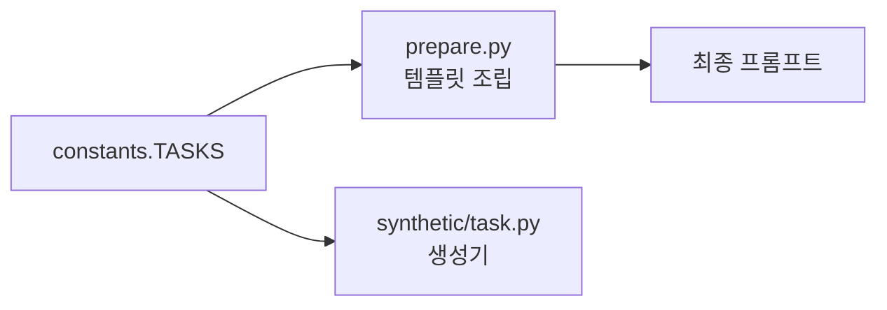

# `benchmark/ruler/data/synthetic/constants.py` 분석

## 개요
RULER 합성 태스크의 **프롬프트 템플릿·생성 토큰 수 정의 테이블(`TASKS`)** 입니다. 각 태스크(niah, variable_tracking, common_words_extraction, freq_words_extraction, qa)마다 `tokens_to_generate`, `template`, `answer_prefix`를 정의합니다.

## 구조
```
TASKS[task] = {
  'tokens_to_generate': int,   # 생성할 토큰 수
  'template': "...{context}...{query}...",  # 프롬프트 본문
  'answer_prefix': "...",      # 답변 유도 접두어
}
```

## 블록 다이어그램


## 주의
- 데이터 생성 단계(`prepare.py`, 각 생성기)에서 참조되는 순수 설정 파일.
- 채점용 지표는 별도 파일 `eval/synthetic/constants.py`에 정의됩니다.
