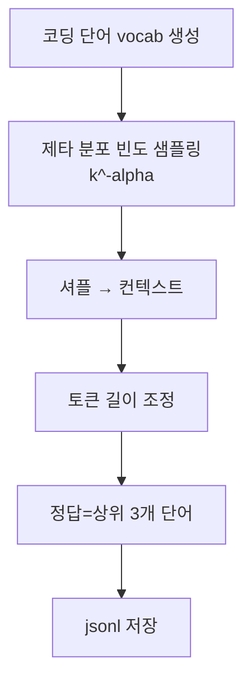

# `benchmark/ruler/data/synthetic/freq_words_extraction.py` 분석

## 개요
RULER의 **빈도 단어 추출(frequent words extraction, `fwe`) 데이터셋 생성기**입니다. Zipf(제타) 분포로 코딩된 단어들을 샘플링해, 가장 자주 등장한 상위 3개 코딩 단어를 찾도록 합니다.

## 주요 함수
| 함수 | 역할 |
|---|---|
| `generate_input_output(...)` | 무작위 코딩 단어 vocab 생성 → 제타 분포로 빈도 샘플링 → 컨텍스트 조립, 정답=상위 3개 |
| 생성 루프 | 목표 길이에 맞게 단어 수 증감 |
| `main()` | jsonl 저장 |

## 핵심 로직
- vocab의 각 단어에 순위 `k`를 매기고, 등장 횟수 ∝ `k^(-alpha)/zeta(alpha)`(Zipf 법칙).
- 최상위 순위 단어(`vocab[0]='...'`)는 노이즈로 취급, 정답은 `vocab[1:4]`.
- `alpha`(기본 2.0)가 빈도 편중 정도를 조절.

## 블록 다이어그램

## 의존성 · 주의
- `scipy`(zeta), `numpy`, `tokenizer.py`에 의존. GPU 불필요.
- 채점은 `string_match_all`.
