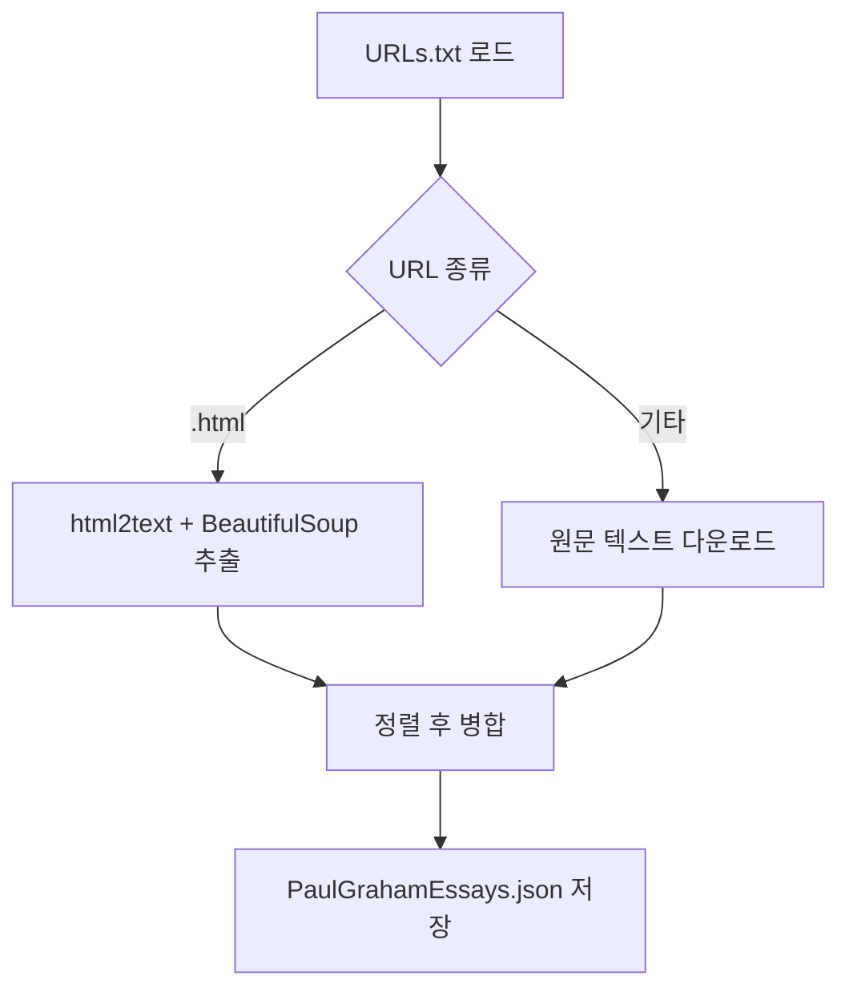

# `benchmark/ruler/data/synthetic/json/download_paulgraham_essay.py` 분석

## 개요
NIAH 태스크의 배경 텍스트(haystack)로 쓰이는 **Paul Graham 에세이를 내려받아 하나의 JSON으로 합치는 스크립트**입니다.

## 핵심 로직
1. `PaulGrahamEssays_URLs.txt`의 URL 목록을 읽음.
2. `.html` URL은 `html2text`+`BeautifulSoup`으로 본문 추출, 그 외는 원문 텍스트 다운로드.
3. 파일명 정렬 후 모든 텍스트를 이어붙여 `PaulGrahamEssays.json`(`{"text": ...}`)으로 저장.
4. 임시 폴더(`essay_repo`, `essay_html`) 정리.

## 블록 다이어그램

## 의존성 · 주의
- `html2text`, `bs4`, 네트워크 접근 필요. GPU 불필요.
- 생성된 JSON은 `niah.py`의 `essay` haystack 모드에서 사용됩니다. `PYTHONHASHSEED=42`로 재현성 고정.
