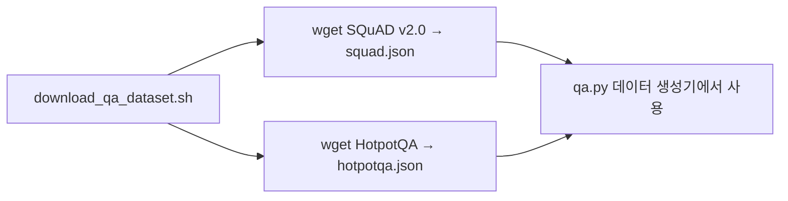

# `benchmark/ruler/data/synthetic/json/download_qa_dataset.sh` 분석

## 개요
RULER의 QA 태스크(`qa_1`, `qa_2`)에 필요한 **원본 QA 데이터셋을 내려받는 스크립트**입니다.

## 핵심 로직
`wget`으로 두 데이터셋을 다운로드:
- SQuAD v2.0 dev → `squad.json`
- HotpotQA dev (distractor) → `hotpotqa.json`

## 블록 다이어그램

## 의존성 · 주의
- `wget` 및 네트워크 접근 필요. GPU 불필요.
- 다운로드한 데이터는 `data/synthetic/qa.py`가 골든/방해 문서로 사용합니다(README의 RULER 데이터 준비 절차).
