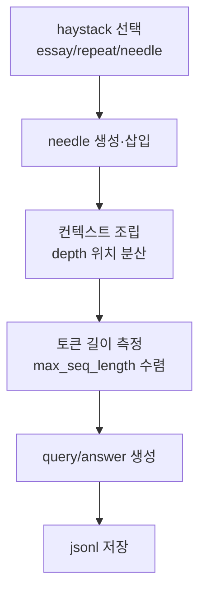

# `benchmark/ruler/data/synthetic/niah.py` 분석

## 개요
RULER의 **NIAH(Needle In A Haystack) 데이터셋 생성기**입니다. 긴 배경 텍스트(haystack) 속에 "매직 값(needle)"을 심고, 특정 key에 대한 값을 찾도록 하는 검색 태스크 샘플을 만듭니다. 단일/다중 key·value·query, 숫자/단어/UUID 등 복잡도를 조절할 수 있습니다.

## 주요 함수
| 함수 | 역할 |
|---|---|
| `generate_random(type)` | needle 값 생성(numbers/words/uuids) |
| `generate_input_output(num_haystack)` | needle 삽입 + 컨텍스트 조립 + query/answer 생성 |
| `generate_samples(...)` | 목표 `max_seq_length`에 맞게 haystack 크기를 이진 탐색적으로 조정하며 샘플 생성 |
| `main()` | jsonl 저장 |

## 핵심 로직
- haystack 종류: `essay`(Paul Graham 에세이), `repeat`(반복 문장), `needle`.
- needle을 문장 깊이(depth) 위치에 분산 삽입 → 다양한 위치의 검색 능력 평가.
- 토크나이저로 길이를 재며 컨텍스트를 목표 길이에 수렴시킴.

## 블록 다이어그램

## 의존성 · 주의
- `wonderwords`, `nltk`(문장 분절), `tokenizer.py`에 의존. GPU 불필요.
- `essay` 모드는 `json/PaulGrahamEssays.json`(download 스크립트로 생성) 필요.
