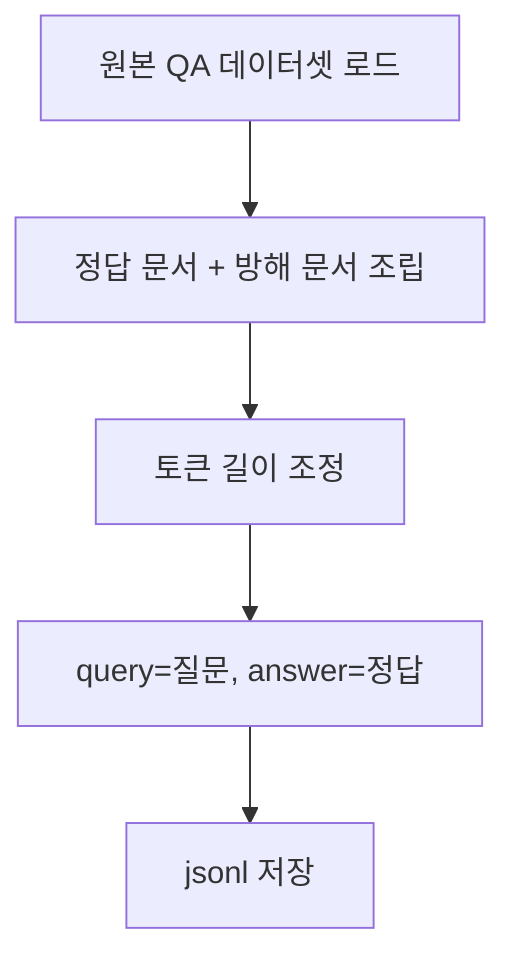

# `benchmark/ruler/data/synthetic/qa.py` 분석

## 개요
RULER의 **문서 기반 QA(`qa_1`, `qa_2`) 데이터셋 생성기**입니다. 외부 QA 데이터셋(SQuAD/HotpotQA 등)의 질문·정답·근거 문서를 이용해, 다수의 방해 문서(distractor) 사이에 정답 문서를 섞은 긴 컨텍스트 QA 샘플을 만듭니다.

## 주요 구성 요소
| 구성 | 역할 |
|---|---|
| `--dataset` | 원본 QA 데이터셋 파일 지정 |
| `--pre_samples` | 이미 생성된 샘플 수(청크 이어붙이기용) |
| `generate_input_output(...)` | 정답 문서 + 방해 문서를 섞어 컨텍스트 조립, query=질문, answer=정답 |
| `main()` | 목표 길이에 맞게 문서 수 조정하며 jsonl 저장 |

## 핵심 로직
- 정답을 포함하는 golden 문서를 다수의 무관 문서 사이에 배치 → 긴 컨텍스트에서 근거 검색·추론 능력 평가.
- 토크나이저로 길이를 재며 문서 수를 목표 길이에 맞춤.

## 블록 다이어그램

## 의존성 · 주의
- 원본 QA 데이터셋 다운로드 필요(README의 `download_qa_dataset.sh`). `tokenizer.py`에 의존, GPU 불필요.
- 채점은 `string_match_part`(정답 문자열 포함 여부).
