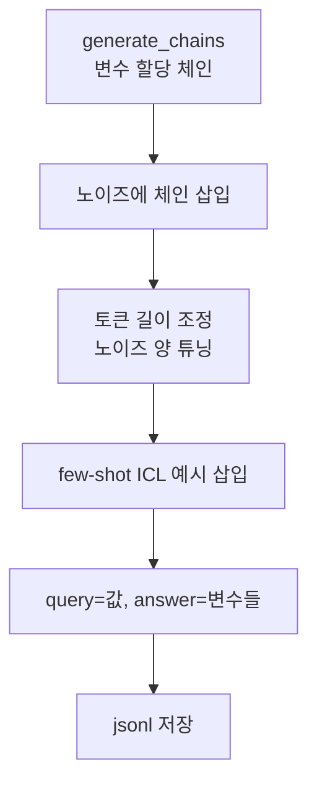

# `benchmark/ruler/data/synthetic/variable_tracking.py` 분석

## 개요
RULER의 **변수 추적(variable tracking, `vt`) 데이터셋 생성기**입니다. 노이즈 문장 속에 변수 할당 체인(`VAR X = 12345`, `VAR Y = VAR X` …)을 숨기고, 특정 값이 할당된 모든 변수를 찾도록 하는 multi-hop 추론 태스크를 만듭니다.

## 주요 함수
| 함수 | 역할 |
|---|---|
| `generate_chains(num_chains, num_hops)` | 무작위 변수명으로 할당 체인 생성(hop마다 이전 변수 참조) |
| `generate_input_output(...)` | 체인을 노이즈 문장 사이에 무작위 위치로 삽입, query=값·answer=변수들 |
| `sys_vartrack_w_noise_random(...)` | 목표 길이에 맞게 노이즈 양 조정하며 샘플 생성(few-shot ICL 예시 포함 옵션) |
| `main()` | ICL 예시 1개 생성 후 본 샘플 생성·저장 |

## 핵심 로직
- 체인 길이 = `num_hops+1`, 첫 변수에만 숫자 값 부여, 나머지는 이전 변수를 따라 같은 값 전파.
- 정답은 같은 값을 가지는 모든 변수(체인 전체) → 모델이 참조를 끝까지 추적해야 정답.

## 블록 다이어그램

## 의존성 · 주의
- `constants.TASKS`, `tokenizer.py`, `utils.dump_jsonl`에 의존. GPU 불필요.
- README 예시의 `vt` 태스크에 해당.
