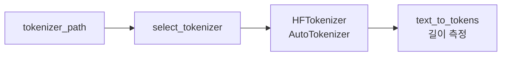

# `benchmark/ruler/data/tokenizer.py` 분석

## 개요
RULER 데이터 생성기가 **토큰 길이를 재기 위해 사용하는 토크나이저 래퍼**입니다. HuggingFace 토크나이저를 얇게 감쌉니다.

## 구성 요소
| 구성 | 역할 |
|---|---|
| `select_tokenizer(type, path)` | `hf`면 `HFTokenizer` 반환 |
| `HFTokenizer.text_to_tokens(text)` | 텍스트→토큰 리스트(길이 측정용) |
| `HFTokenizer.tokens_to_text(tokens)` | 토큰→텍스트 복원 |

## 블록 다이어그램

## 주의
- 데이터 생성기(niah 등)가 목표 컨텍스트 길이에 맞추려고 토큰 수를 셀 때 사용.
- `hf` 타입만 구현되어 있습니다(nemo/openai는 미구현).
