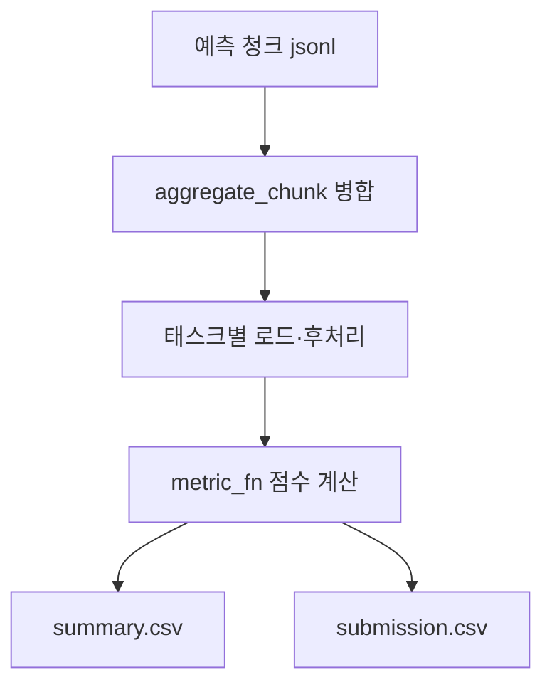

# `benchmark/ruler/eval/evaluate.py` 분석

## 개요
RULER 예측 jsonl을 읽어 **태스크별 점수와 null 예측 수를 집계하는 채점 스크립트**입니다(NVIDIA 원본 이식). 청크로 나뉜 예측 파일을 병합하고, 태스크별 지표 함수로 점수를 계산해 `summary.csv`/`submission.csv`를 생성합니다.

## 주요 함수
| 함수 | 역할 |
|---|---|
| `postprocess_pred(...)` | 예측 문자열 정리(비출력 문자 제거) |
| `get_pred_and_ref(...)` | 예측 jsonl에서 입력/예측/정답/인덱스 추출 |
| `run_evaluation_per_task(...)` | `metric_fn`으로 점수 계산, null 비율 산출 |
| `aggregate_chunk(folder)` | `task-0.jsonl`류 청크 파일을 `task.jsonl`로 병합 |
| `write_evaluation`/`write_submission` | 점수 요약 csv, 제출 csv 생성 |

## 블록 다이어그램

## 의존성 · 주의
- `eval/synthetic/constants.TASKS`의 `metric_fn`, `pandas`, `nltk`에 의존. GPU 불필요.
- 입력 경로는 `pred/call_api.py`의 출력과 일치해야 함.
